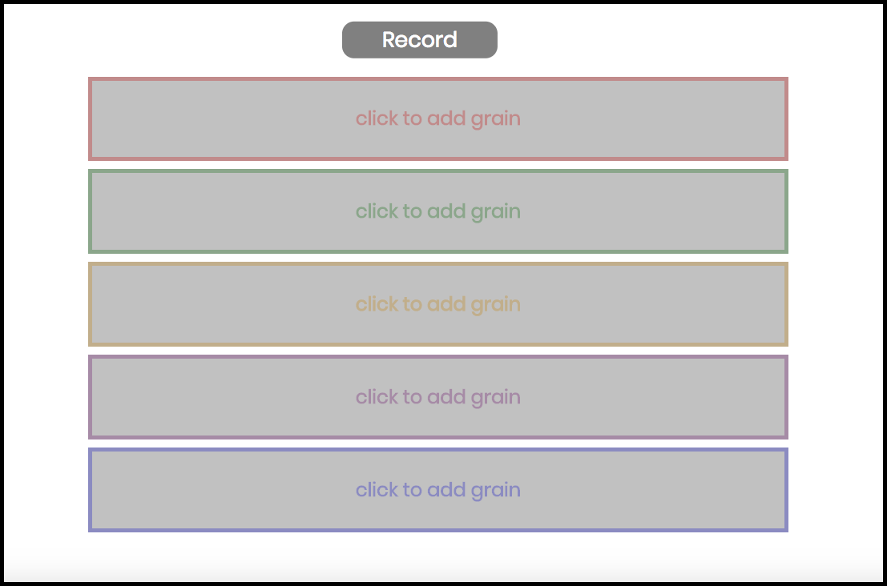
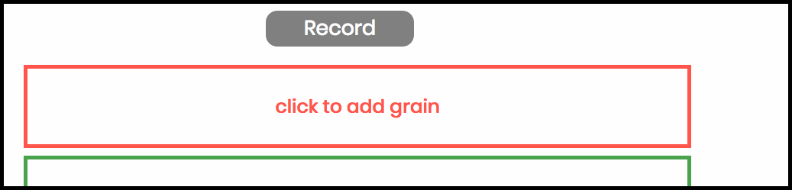
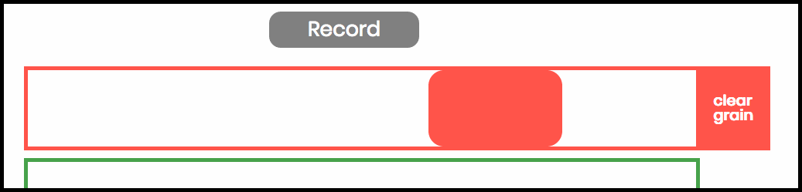
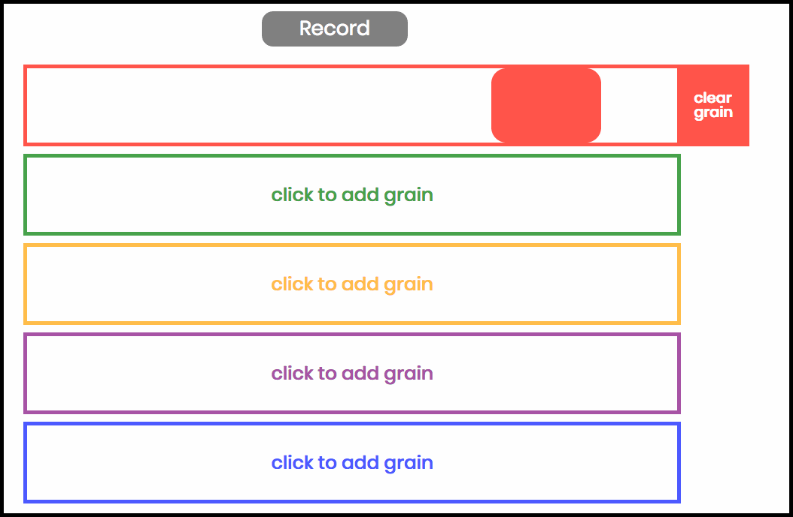

<h1><a href="https://ccrma.stanford.edu/~mherrero/220c/grains4u/">Grains4u</a> - The Granular Synthesis Sandbox Application</h1>

## What is Grains4u?
#### Grains4u is a granular synthesis web application, built using HTML, CSS, Javascript, and the Web Audio API. It is intended to be a fun sandbox application for folks with no knowledge of granular synthesis, so they can get their hands dirty and play with this cool form of sound generation!

## How do I use Grains4u?
#### When the Grains4u page loads, this is what you will see:

  

#### To use the app, follow these steps!

<ol>
    <li>
        <h4> Make sure to allow Grains4u access to your microphone:</h4>
          
    </li>
    <li>
        <h4>Record a sound!</h4>
          
    </li>
    <li>
        <h4>Click a Grain Box to start a grain playing:</h4>
          
    </li>
    <li>
        <h4>Drag and stretch the grain to change it's position and length:</h4>
          
    </li>
    <li>
        <h4>Click to add more! Or click "Clear Grain" to remove grains:</h4>
          
    </li>
</ol>

<h4>Recording a new audio sample automatically clears all grains. So get granular, see what crazy sounds you can make!</h4>

## What is Granular Synthesis?
Granular synthesis is a form sound synthesis. At a basic level, granular synthesis involves taking some
recorded sound and slicing some tiny chunck of audio out of it. This chunk is referred to as a *grain*, 
and it is usually on the order of hundreds to tens of milliseconds in length. By playing this grain repeatedly
over and over, the resulting sound is quite different than the original sample from which the grain came, and thus
it is a new sound!

There are many techniques computer musicians use to alter the grains and how they are played in order to affect the
synthesized sound. Some of these techniques include:
* __Layering:__ When layering grains, the process involves playing multiple grains at once, or playing the same grain at
intervals shorter than grain's length (ie: playing the next grain when the previous grain is halfway through playing). Layering can often
smooth a granular synthesized sound, especially when applied with a volume envelope.
* __Envelopes:__ Often times, a volume envelope is applied to the grain, so that there is some sort of fading-in and fading-out of the grain.
Different Envelope shapes (exponetial, triangle, bezier, etc.) also might add slightly different qualities to the sound.
* __Play Rate:__ Altering play rate of the grain usually serves to pitch the sound up or down, but can also reveal some interesting textures, especially
when pitching the sound down!
* __Uncertainty:__ There are many points in the granular synthesis process where probalities can be introduced, which can also reveal new textures
in the sound. For example, the play rate, how often the grain is played, where the grain starts relative to the overall sample, grain length, all these
parameters can include proabilities, and changes in these values often generate changes in the synthesized sound.

For further reading, as always, one can check out the [Wikipedia page for Granular Synthesis] (https://en.wikipedia.org/wiki/Granular_synthesis) 

## Sources
 * https://goo.gl/NIerhh
 * https://goo.gl/nZF0x5
 * https://goo.gl/bcIYL7
 * https://goo.gl/VaV8kX
 * https://goo.gl/86PNFT
 * https://goo.gl/RVYeG5
 * https://goo.gl/tNB9Bf
 * https://goo.gl/t7ivz4
 * https://goo.gl/iMWzDQ

#### built by Matt Herrero, 2016